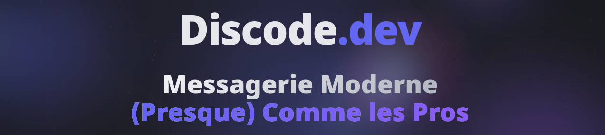

<div align="center">

# 🚀 Discode.dev

<picture>
  <source media="(prefers-color-scheme: dark)" srcset="./assets/logo-dark.png">
  
</picture>

### Modern Real-Time Messaging for Teams
**Secure Communication • AI-Powered • Scalable Architecture**

[](https://discode.dev)
[](https://discode.dev)
[](https://github.com)

<p align="center">
  <a href="https://discode.dev">🌐 Live Demo</a> •
  <a href="#features">✨ Features</a> •
  <a href="#tech-stack">🛠️ Tech Stack</a> •
  <a href="#architecture">🏗️ Architecture</a> •
  <a href="#screenshots">📸 Screenshots</a>
</p>



</div>

---

## 📖 About

**Discode** is a modern instant messaging platform built for teams who value efficient communication. Developed as a student project, it combines cutting-edge web technologies with AI-powered features to deliver a seamless chat experience.

> ⚠️ **Note**: This is a showcase repository. Source code is private but available upon request for academic evaluation or professional review.

### 🎯 Project Goals

<table>
<tr>
<td width="25%" align="center">
<br />
<strong>Learn Modern Stack</strong><br />
Master full-stack development with real-time architectures
</td>
<td width="25%" align="center">
<br />
<strong>AI Integration</strong><br />
Experiment with OpenAI API in production environment
</td>
<td width="25%" align="center">
<br />
<strong>Security First</strong><br />
Implement enterprise-grade security practices
</td>
<td width="25%" align="center">
<br />
<strong>Scalable Design</strong><br />
Build architecture ready for growth
</td>
</tr>
</table>

---

## ✨ Features

<details open>
<summary><strong>💬 Real-Time Messaging</strong></summary>
<br />

- ⚡ Instant message delivery via WebSocket (Socket.IO)
- 👀 Live presence indicators and typing status
- 💾 Persistent message history
- 😊 Emoji reactions and rich text support
- 🔍 Full-text search across conversations


</details>

<details>
<summary><strong>🤖 AI-Powered Features</strong></summary>
<br />

- 🛡️ Automatic content moderation
- 💡 Smart reply suggestions
- 📝 Conversation summaries
- 🚫 Spam and inappropriate content detection
- 🌍 Real-time translation (coming soon)


</details>

<details>
<summary><strong>🔒 Security & Authentication</strong></summary>
<br />

- 🔐 JWT-based authentication
- 🔑 Bcrypt password hashing
- 🛡️ CSRF and XSS protection
- ✅ Server-side input validation
- 🔄 Automatic session management

</details>

<details>
<summary><strong>👥 Team Management</strong></summary>
<br />

- 🏢 Multi-server organization
- 📢 Channel-based communication
- 👑 Role-based permissions
- 🔗 Invite link generation
- ⚙️ Advanced admin controls

</details>

<details>
<summary><strong>🎨 Modern UI/UX</strong></summary>
<br />

- 📱 Mobile-first responsive design
- 🌙 Dark mode by default (light mode available)
- ✨ Smooth animations and transitions
- ♿ Accessibility-focused (WCAG 2.1)
- 🎭 Customizable themes


</details>

---

## 🛠️ Tech Stack

<div align="center">

### Frontend


### Backend


### AI & Tools


</div>

---

## 🏗️ Architecture

### System Overview

```
graph TB
    Client[React Client<br/>Socket.IO Client]
    Gateway[Nginx Gateway<br/>Load Balancer]
    Auth[Auth Service<br/>JWT & Sessions]
    Chat[Chat Service<br/>WebSocket Handler]
    AI[AI Service<br/>OpenAI Integration]
    DB[(PostgreSQL<br/>Primary Database)]
    Cache[(Redis<br/>Cache & Sessions)]
    
    Client -->|HTTPS/WSS| Gateway
    Gateway --> Auth
    Gateway --> Chat
    Chat --> AI
    Auth --> DB
    Chat --> DB
    Auth --> Cache
    Chat --> Cache
    AI -->|API Calls| OpenAI[OpenAI API]
    
    style Client fill:#6366f1,color:#fff
    style Gateway fill:#8b5cf6,color:#fff
    style DB fill:#10b981,color:#fff
    style Cache fill:#ef4444,color:#fff
    style OpenAI fill:#ec4899,color:#fff
```

### Data Flow


<details>
<summary><strong>View detailed flow description</strong></summary>

1. **Authentication Flow**
   - User credentials → Auth service
   - JWT token generated & stored in localStorage
   - Token validated on each request via middleware

2. **Messaging Flow**
   - Client sends message via WebSocket
   - Server validates & stores in PostgreSQL
   - Message broadcast to connected clients
   - Redis caches recent messages for fast retrieval

3. **AI Processing Flow**
   - Message sent to AI service asynchronously
   - OpenAI API analyzes content
   - Results stored and actions taken if needed
   - Original sender notified of any issues

</details>

### Database Schema


> 📄 [View full schema documentation](./docs/database-schema.md)

---

## 📸 Screenshots

<div align="center">

### Main Chat Interface


*Modern, Discord-inspired interface with smooth animations*

---

### Server Management

<table>
<tr>
<td width="50%">

<p align="center"><em>Server & Channel Organization</em></p>
</td>
<td width="50%">

<p align="center"><em>Advanced Settings & Permissions</em></p>
</td>
</tr>
</table>

---

### AI Features in Action


*Real-time content moderation with AI-powered suggestions*

---

### Mobile Experience

<table>
<tr>
<td width="33%">

<p align="center"><em>Responsive Chat View</em></p>
</td>
<td width="33%">

<p align="center"><em>Mobile Navigation</em></p>
</td>
<td width="33%">

<p align="center"><em>Settings Panel</em></p>
</td>
</tr>
</table>

</div>

---

## 🚀 Roadmap

```
timeline
    title Discode Development Roadmap
    section Phase 1
        Q4 2024 : MVP Launch
               : Basic Authentication
               : Real-time Messaging
               : Server/Channel Creation
    section Phase 2
        Q1 2025 : Current Phase
               : AI Integration
               : UI/UX Improvements
               : Performance Optimization
    section Phase 3
        Q2 2025 : Planned Features
               : Voice/Video Calls (WebRTC)
               : File Sharing System
               : Mobile Apps (React Native)
    section Phase 4
        2025+ : Future Vision
               : Public API
               : Webhook System
               : Self-Hosting Option
```

### Detailed Progress

<details open>
<summary><strong>✅ Phase 1 - MVP (Completed Q4 2024)</strong></summary>

- [x] User authentication & registration
- [x] Real-time messaging via WebSocket
- [x] Server and channel creation
- [x] Basic user profiles
- [x] Message persistence

</details>

<details open>
<summary><strong>🚧 Phase 2 - Current (Q1 2025)</strong></summary>

- [x] AI-powered content moderation
- [x] UI/UX overhaul with modern design
- [x] Performance optimizations (Redis caching)
- [ ] Advanced permission system
- [ ] Rich text editor
- [ ] User presence system

</details>

<details>
<summary><strong>📋 Phase 3 - Next (Q2 2025)</strong></summary>

- [ ] Voice/Video calls (WebRTC)
- [ ] File upload & sharing
- [ ] Push notifications
- [ ] Advanced search
- [ ] Automated testing suite
- [ ] Mobile applications (iOS/Android)

</details>

<details>
<summary><strong>🔮 Phase 4 - Future (2025+)</strong></summary>

- [ ] Public REST API
- [ ] Bot framework & webhooks
- [ ] Plugin system
- [ ] Self-hosting documentation
- [ ] Enterprise features
- [ ] End-to-end encryption

</details>

---

## 📊 Project Statistics

<div align="center">

<table>
<tr>
<td align="center">
<br />
<strong>15,000+</strong><br />
Lines of Code
</td>
<td align="center">
<br />
<strong>6 Months</strong><br />
Development Time
</td>
<td align="center">
<br />
<strong>12+</strong><br />
Technologies Used
</td>
<td align="center">
<br />
<strong>300+</strong><br />
Git Commits
</td>
</tr>
</table>

### Performance Metrics

| Metric | Value | Status |
|--------|-------|--------|
| 🚀 **Uptime** | 99.2% | 🟢 Excellent |
| ⚡ **Message Latency** | <100ms | 🟢 Fast |
| 💾 **Database Response** | <50ms | 🟢 Optimized |
| 📦 **Bundle Size** | 245KB (gzipped) | 🟡 Good |
| 🎯 **Lighthouse Score** | 92/100 | 🟢 Great |

</div>

---

## 🎓 Academic Context

This project was developed as part of my **[Degree Name]** at **[University/School Name]**. It serves as both a learning exercise and a portfolio piece demonstrating full-stack development capabilities.

### Learning Objectives Achieved

✅ **Full-Stack Development** - Mastered React, Node.js, and PostgreSQL ecosystem  
✅ **Real-Time Systems** - Implemented WebSocket architecture with Socket.IO  
✅ **AI Integration** - Successfully integrated OpenAI API for practical use cases  
✅ **Security Practices** - Applied industry-standard authentication and data protection  
✅ **DevOps Fundamentals** - Containerized application with Docker and Docker Compose  
✅ **Project Management** - Managed full development lifecycle from concept to deployment

<details>
<summary><strong>📋 Project Details</strong></summary>

- **Institution**: [Your School/University]
- **Program**: [Your Degree/Program]
- **Supervisor**: [Professor Name] *(if applicable)*
- **Duration**: September 2024 - March 2025
- **Team Size**: Solo Project
- **Grade/Evaluation**: [If you want to include]

</details>

---

## 🤝 Contributing & Feedback

While the source code is private, I welcome:

<table>
<tr>
<td align="center">
💡<br /><strong>Feature Ideas</strong><br />
Suggest new features
</td>
<td align="center">
🐛<br /><strong>Bug Reports</strong><br />
Report issues you find
</td>
<td align="center">
💬<br /><strong>UX Feedback</strong><br />
Share your experience
</td>
<td align="center">
🤔<br /><strong>Questions</strong><br />
Ask about implementation
</td>
</tr>
</table>

### How to Provide Feedback

1. 🌐 **Test the application** at [discode.dev](https://discode.dev)
2. 📝 **Open an Issue** for bugs or feature requests
3. 💭 **Start a Discussion** for general questions or ideas
4. ⭐ **Star this repository** if you find it interesting!

---

## 📧 Contact & Connect

<div align="center">

**Developer**: HamoudE

[](https://your-portfolio.com)
[](https://linkedin.com/in/yourprofile)
[](mailto:your.email@example.com)
[](https://github.com/HamooudE)

</div>

---

## 📜 License & Usage

<div align="center">

**Closed Source • Educational Use Only**

</div>

This project is proprietary and **not open source**. However, it's available for:

- ✅ **Personal exploration** via the live demo
- ✅ **Academic evaluation** by instructors
- ✅ **Portfolio demonstration** for potential employers
- ✅ **Technical interviews** with code sharing upon request

**Not permitted without authorization:**
- ❌ Code distribution or reproduction
- ❌ Commercial use or deployment
- ❌ Derivative works

> 📩 **Source code available upon request** for academic review or professional evaluation. Contact me via email or LinkedIn.

---

## 🙏 Acknowledgments

Special thanks to:

- **OpenAI** for providing the GPT API
- **Discord & Telegram** for UI/UX inspiration
- **Stack Overflow Community** for countless solutions
- **[Professor Name]** for guidance and support *(if applicable)*
- My **coffee machine** for the endless fuel ☕

### Resources & Inspiration

- [System Design Primer](https://github.com/donnemartin/system-design-primer)
- [Real-Time Web Architecture](https://socket.io/docs/)
- [React Best Practices](https://react.dev/)

---

<div align="center">

## 💫 Support This Project

If you find this project interesting or useful:

⭐ **Star this repository**  
🔗 **Share with others**  
💬 **Provide feedback**  
📧 **Get in touch**

---

**Made with ❤️, ☕, and countless hours of debugging**

[](https://github.com/HamooudE)
[](https://buymeacoffee.com/yourprofile)

[⬆ Back to Top](#-disscodedev)

</div>
